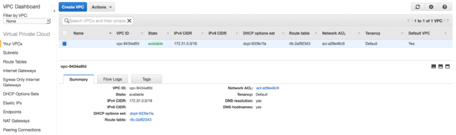

AwsEc2Helper:
--------------------------------------
_This repository contains a helper class that creates per region wrappers around commonly used [AWS SDK][4a3d724e] functions._


**Table of Contents**
<!-- TOC -->

- [_Configuration File_](#_configuration-file_)
  - [`dry_run`](#dry_run)
  - [`log_path`](#log_path)
  - [AWS Integration:](#aws-integration)
    - [`use_cli_config`](#use_cli_config)
    - [`cli_profile_name`](#cli_profile_name)
    - [`access_key_id`](#access_key_id)
    - [`secret_key`](#secret_key)
  - [Cluster Information:](#cluster-information)
    - [`region_name`](#region_name)
    - [`vpc_id`](#vpc_id)
    - [`instance_ids`](#instance_ids)

<!-- /TOC -->

### _Configuration File_
The configuration of this script is controlled via its `config.json` file. In this section, we'll breakdown the various configuration options, and where to find the information you need to complete the provided template.

```javascript
"dry_run": false,
"log_path": "./logs"
```
#### `dry_run`
- _Type_: Boolean
- _Function_: Controls the AWS API's `DryRun` feature. If `true`, then all AWS API operations will check to see if you have correct permissions. If you have the required permissions, the error response is `DryRunOperation` . Otherwise, it is `UnauthorizedOperation`.

#### `log_path`
- _Type_: String
- _Function_: Controls where the script outputs files to. If the directory doesn't exist, it will attempt to make it. However, the script is currently unable to make additional sub-directories.

```javascript
"aws": {
  "use_cli_config": true,
  "cli_profile_name": false,
  "access_key_id": false,
  "secret_key": false
}
```
#### AWS Integration:
##### `use_cli_config`
- _Type_: Boolean
- _Function_: This flag configures the script to tell `boto3` to utilize your existing AWS CLI configuration for it's credentials.
- _Note_: For more information on how `boto3` handles credential/configuration detection, please see [Configuring Credentials][f9b96542]

##### `cli_profile_name`
- _Type_: String
- _Depends On_: `"use_cli_config": true`
- _Function_: If provided, `boto3` will load the AWS CLI configuration for the given AWS CLI profile.
- _Default Value_: `false` - Any other string value will be treated as a profile name. To disable this flag, leave it as `false`.
- _Note_: For more information on AWS CLI Named Profiles, please see their [documentation][2535939a].

**_NOTE: The below options should be avoided, as they store the credentials in plain text. To retrieve these credentials, see AWS' [Understanding and Getting Your Security Credentials][ba0786b6]_**
##### `access_key_id`
- _Type_: String
- _Depends On_: `"use_cli_config": false` - Otherwise the AWS CLI configuration will be used.
- _Function_: Allows for AWS Integration without having the AWS CLI configured.

##### `secret_key`
- _Type_: String
- _Depends On_: `"use_cli_config": false` - Otherwise the AWS CLI configuration will be used.
- _Function_: Allows for AWS Integration without having the AWS CLI configured.

#### Cluster Information:
```javascript
"clusters": {
  "r1": {
    "region_name": "us-east-1",
    "vpc_id": "vpc-f408c1e0946602185",
    "instance_ids": [
      "i-3f5635430734aaae7",
      "i-57f353e04346a73aa",
      "i-5440aaa65e33f7337"
    ]
  },
  "r2": {
    "region_name": "us-west-1",
    "vpc_id": "vpc-9c08e46025416f810",
    "instance_ids": [
      "i-5075673344aa3fea3",
      "i-4a4657e5033af73a3",
      "i-57033f343a57e4a6a"
    ]
  }
}
```
**Each region/cluster requires the following information**:
##### `region_name`
- _Type_: String
- _Function_: Allows the `AwsEc2Helper` object to be target the exact region of the given cluster. It is used by the embedded `boto3` client, when the `AwsEc2Helper` object is initialized.
- _Note_: For more information on AWS Regions, please see their [documentation][852d5a65].

##### `vpc_id`
- _Type_: String
- _Function_: Allows the `AwsEc2Helper` object to be target the exact vpc of the given cluster. It is used by the embedded `boto3` client, when the `AwsEc2Helper` object is initialized.
- _Note_: This information can be retrieved via the AWS Managment Console, or the AWS CLI's [`describe-vpcs`](https://docs.aws.amazon.com/cli/latest/reference/ec2/describe-vpcs.html) command.
- _Screenshot_: 

##### `instance_ids`
- _Type_: String
- _Function_: Allows the `AwsEc2Helper` object to be target the exact instances of the given cluster. It is used by the embedded `boto3` client, when the `AwsEc2Helper` object is initialized. **_This information is required for each instance in the Auth0 PSaaS appliance deployed in the given region._**
- _Note_: For more information on AWS Instance Metadata, please see their [documentation][aed640b1].


  [ba0786b6]: https://docs.aws.amazon.com/general/latest/gr/aws-sec-cred-types.html#access-keys-and-secret-access-keys "Understanding and Getting Your Security Credentials - Access Keys"
  [f9b96542]: https://boto3.amazonaws.com/v1/documentation/api/latest/guide/configuration.html#configuring-credentials "Boto3 Docs - Configuring Credentials"
  [2535939a]: https://docs.aws.amazon.com/cli/latest/userguide/cli-configure-profiles.html "AWS CLI Configuration - Named Profiles"
  [4a3d724e]: https://aws.amazon.com/sdk-for-python/ "AWS SDK for Python (Boto3)"
  [852d5a65]: https://docs.aws.amazon.com/general/latest/gr/rande.html "AWS Regions and Endpoints"
  [aed640b1]: https://docs.aws.amazon.com/AWSEC2/latest/UserGuide/ec2-instance-metadata.html#instancedata-data-retrieval "Instance Metadata and User Data - Retrieving Instance Metadata"
